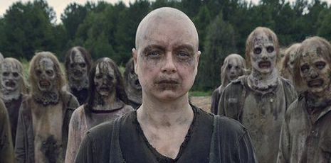
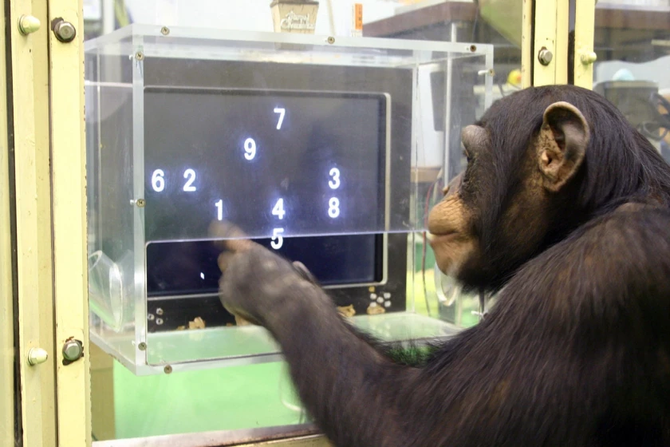

class: center, middle

# You can't do much carpentry with your bare hands, and you can't do much thinking with your bare brain. 

### Bo Dahlbom

---
class: inverse, center, middle

# Първо, няколко дефиниции

---
# Няма да говорим за Доналд Тръмп

.center[]

---
# Рационалност

--
## Рационалните числа са отношенията между две числа;

--
## хората са рационални, когато поведението им отговаря на определени критерии.

---
# Критерии за рационалност

--
- Транзитивност: ако алтернатива А1 се предпочита пред алтернатива А2 и алтернатива А2 пред А3, то алтернатива А1 се предпочита пред А3.

--
- Пълнота: всички възможности за действие да бъдат представени като алтернативи, които могат да бъдат подредени съобразно очакваната полза от тях.

--
- Доминантност: рационалното решение е избор на най-добрата възможна или поне равна на другите алтернатива, т.е. тази, която доминира всички останали.

--
- Инвариантност: алтернативите да бъдат качествено обособени една от друга така, че те да не представляват просто репрезентации една на друга 

---
# Зомбита

--
- Критериите за рационалност ни позволяват да се поставяме на мястото на други хора.

--
- Въпреки, че не можем да репликираме мисленето им в цялата му пълнота, можем да създаваме модели.

--
- Те са непълни, т.е. създаваме зомбита:

.center[]

---
class: inverse, center, middle

# Сега вече можем да говорим за проблема, който решаваме

---
# The Ultimatum Game

--
- Дадена е известна сума пари;

--
- двама играчи;

--
- първият предлага някакво разделяне на тези пари;

--
- вторият може да приеме или откаже;

--
- ако приеме, всеки получава своята част, определена от предложеното от първият играч;

--
- ако откаже, не получават нищо.

---
# The Ultimatum Game, продължение

--
- Можем да направим таблица със стратегиите и резултатите на играчите:

<table border="0"><tr>
    <td align='center'>Играч 1/ Играч 2</td>
    <th align='center'>приема</th>
    <th align='center'>отказва</th>
  </tr><tr>
    <th align='center'>справедливо</th>
    <td align='center'>  1-h, h</td>
    <td align='center'> 0, 0</td>
  </tr><tr>
    <th align='center'>несправедливо</th>
    <td align='center'>  1-l, l</td>
    <td align='center'>  0, 0</td>
</tr></table>

--
Как рационалните хора биха играли играта?
---

.center[]

"Chimpanzees at the Primate Research Institute of Kyoto University outperformed humans in competitive strategic games. Here, Aymu, a 5 1/2-year-old chimpanzee, performs a memory test on a computer screen. (Primate Research Institute of Kyoto University)"

---
# Изкуството на сделката

--
- A Beautiful Mind

.center[]

---

background-image: url(pippin.jpg)
background-size: contain
background-position: 50% 50%
class: center, bottom, inverse

# You only live once!

---

class: center, middle

# Благодаря!

Слайдовете са създадени с пакета [**xaringan**](https://github.com/yihui/xaringan), с помощта на [remark.js](https://remarkjs.com), [**knitr**](https://yihui.org/knitr/), и [R Markdown](https://rmarkdown.rstudio.com).

